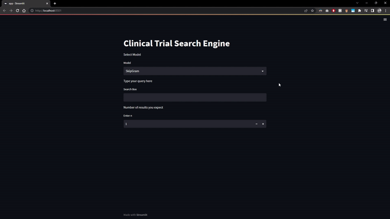

# Medical Embeddings and Clinical Trial Search Engine

## 1. Create a new environment

   - `conda create -p med_venv python==3.10 -y`
   - `conda activate med_venv/`

## 2. Install all the requirements

- `python -m pip install --upgrade pip`

- `pip install -r src/requirements.txt`

- `conda install jupyter` (to run the jupyter notebook)

## 3. Code Execution

   - Run `python src/engine.py` to train the model
   - Run `streamlit run src/app.py` to run the streamlit app

   
* **

### What does the code do??

- The Project aims to train SkipGram and FastText Models on [COVID-19 Clinical Trials Dataset](https://dimensions.figshare.com/articles/dataset/Dimensions_COVID19_publications_datasets_and_clinical_trials/11961063) and builds a Search Engine where user can type any COVID-19 related keyword and it presents all the top n similar results from the dataset

- Application Demo

* **

# <h1 align="center">Word2Vec and FastText Word Embedding with Gensim</h1>

## Business Context:

We all must have wondered that if we search for a particular word in google, it does not show just the results that contain the very same word but also shows results that are very closely related to it. For example, if we search for the term ‘medicine’ in google, you can see results that not just include the word ‘medicine’ but also terms such as "health", "pharmacy", "WHO", and so on. So, google somehow understands that these terms are closely related to each other. This is where word embeddings come into the picture. Word embeddings are nothing but numerical representations of words in a sentence depending on the context.

General word embeddings might not perform well enough on all the domains. Hence, we need to build domain-specific embeddings to get better outcomes. In this project, we will create medical word embeddings using Word2vec and FastText in python.

## Data Description
We are considering a clinical trials dataset for our project based on Covid-19. [Dataset-Link](https://dimensions.figshare.com/articles/dataset/Dimensions_COVID19_publications_datasets_and_clinical_trials/11961063)

There are 10666 rows and 21 columns present in the dataset. The following two columns are essential for us,
* `Title`
* `Abstract`

## Aim
**This project aims to use the trained models (Word2Vec and FastText) to build a search engine and Streamlit UI.**

To develop a machine learning application that can understand the relationship and pattern between various words used together in the field of medical science, create a smart search engine for records containing those terms, and finally build a machine learning pipeline in azure to deploy and scale the application.

## Tech stack
- **Language** - Python
- **Libraries and Packages** - `Pandas`, `Numpy`, `Matplotlib`, `Plotly`, `Gensim`, `Streamlit`, `NLTK`.

## Approach

- **Check my Jupyter notebooks:**
    - [Theory Notebook](https://github.com/avr2002/Medical-Embeddings-and-Clinical-Trial-Search-Engine/blob/main/Notebooks/theory.ipynb)
    - [Main Notebook](https://github.com/avr2002/Medical-Embeddings-and-Clinical-Trial-Search-Engine/blob/main/Notebooks/Medical_Embeddings.ipynb)

1. Importing the required libraries
2. Reading the dataset
3. Pre-processing
    - Remove URLs
    - Convert text to lower case
    - Remove numerical values
    - Remove punctuation.
    - Perform tokenization
    - Remove stop words
    - Perform lemmatization
    - Remove ‘\n’ character from the columns
4. Exploratory Data Analysis (EDA)
    - Data Visualization using word cloud
5. Training the ‘Skip-gram’ model
6. Training the ‘FastText’ model
7. Model embeddings – Similarity
8. PCA plots for Skip-gram and FastText models
9. Convert abstract and title to vectors using the Skip-gram and FastText model
10. Use the Cosine similarity function
11. Perform input query pre-processing
12. Define a function to return top ‘n’ similar results
13. Result evaluation
14. Run the Streamlit Application
    - Run `streamlit run medical.py` in notebook

## Project Takeaways

1. Understanding the business problem
2. Understanding the architecture to build the Streamlit application
3. Learning the Word2Vec and FastText model
4. Importing the dataset and required libraries
5. Data Pre-processing
6. Performing basic Exploratory Data Analysis (EDA)
7. Training the Skip-gram model with varying parameters
8. Training the FastText model with varying parameters
9. Understanding and performing the model embeddings
10. Plotting the PCA plots
11. Getting vectors for each attribute
12. Performing the Cosine similarity function
13. Pre-processing the input query
14. Evaluating the results
15. Creating a function to return top ‘n’ similar results for a given query
16. Understanding the code for executing the Streamlit application.
17. Run the Streamlit application.

* **

- Links to solve some errors
    - [Link-1](https://www.educative.io/answers/how-to-fix-the-error-fatal-the-remote-end-hung-up-unexpectedly)
    - [Link-2](https://stackoverflow.com/questions/17628305/windows-git-warning-lf-will-be-replaced-by-crlf-is-that-warning-tail-backwar)
    - [Link-3](https://stackoverflow.com/questions/39399804/updates-were-rejected-because-the-tip-of-your-current-branch-is-behind-its-remot)